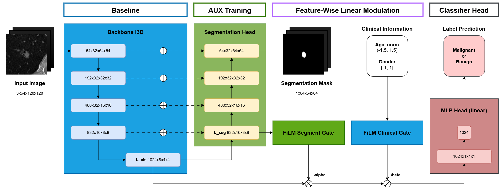

# LUNA25 Model (Advanced Topic) - Team 03 [UET-2526I]
<!-- Some information about team (team number 03, teammates with name, student id and major), luna25 + Introduction into LUNA25 Challenge and this Course [Advanced Topic in Computer Science]'s project -->

<!-- This repo focus on Model [including training, testing and private test] -->

This repository contains the **model implementation and experimental pipeline** developed for the course *Advanced Topics in Computer Science* at the University of Engineering and Technology (UET – VNU). The project focuses on building and evaluating **deep learning models for lung nodule classification and segmentation on CT images** using the **LUNA25 dataset**. The repository provides the core components for **model architecture, training procedures, evaluation, and inference on the private test set**, enabling reproducible experiments for studying AI approaches in lung cancer risk prediction.

## Team Information

| Role | Information |
|-----|-------------|
| **Team** | 03 |
| **Members** | Vũ Thuỳ Trang – 24025157 |
| | Lương Sơn Bá – 24025114 |
| **Course Lecturer** | PGS. TS. Đặng Thanh Hải |

## Project Context

Lung cancer remains one of the **leading causes of cancer-related deaths worldwide**, and early detection through **Low-Dose CT (LDCT)** screening plays a critical role in reducing mortality. However, analyzing the large volume of CT scans produced by screening programs is challenging for radiologists. The **LUNA25 Challenge** provides a benchmark dataset for evaluating **AI models in lung nodule malignancy assessment**. In this project, we investigate deep learning architectures that learn representations from **3D CT volumes** to perform **nodule classification and segmentation**, with the goal of improving predictive performance and exploring how such models could support **clinical decision support systems (CDSS)** in lung cancer screening workflows.

## Model Architecture



The proposed model follows a **multi-task learning architecture** designed to jointly solve **lung nodule segmentation and classification** from 3D CT patches. The segmentation task acts as an **auxiliary objective** that provides spatial and morphological information, helping the model learn better representations for the main task of malignancy classification.

The architecture consists of four main components:

**Backbone.**  
The model uses **Inflated 3D ConvNet (I3D)** as the main feature extractor. Given an input CT patch \(X_{\text{patch}}\), the backbone produces a high-level feature tensor:

$
\mathbf{f}_{\text{cls}} = F_{\text{backbone}}(X_{\text{patch}})
$

These features capture spatial context from the 3D CT volume and serve as the shared representation for both segmentation and classification branches.

**Segmentation Head.**  
The segmentation branch follows an **encoder–decoder design inspired by 3D U-Net**, where the I3D backbone acts as the encoder. Skip connections are used to combine low-level spatial features with high-level semantic features. The head outputs:

- a **3D segmentation logit mask** \(y_{\text{seg}}\)
- an intermediate feature representation \(\mathbf{f}_{\text{seg}}\)

The segmentation output is mainly used as an **auxiliary training signal**, while the intermediate features are later used to modulate classification features.

**FiLM-based Gating Modules.**  
To integrate contextual information, the model applies **Feature-wise Linear Modulation (FiLM)** as gating mechanisms:

- **Segmentation Gate**  
  Uses intermediate segmentation features \(\mathbf{f}_{\text{seg}}\) to generate channel-wise modulation coefficients \(\boldsymbol{\alpha}\).

- **Clinical Gate**  
  Uses normalized clinical metadata (age and gender) to generate modulation coefficients \(\boldsymbol{\beta}\).

These coefficients adjust the backbone features through channel-wise scaling:

$
\mathbf{f}_{\text{cls}} = \mathbf{f}_{\text{cls}} \odot (1 + 0.5\alpha) \odot (1 + \beta)
$

This mechanism allows the model to **adapt classification features based on spatial segmentation cues and clinical context**.

**Classification Head.**  
The classification branch predicts the malignancy label of the nodule. It consists of two stages:

- **Head:** aggregates spatial features using pooling mechanisms such as *average pooling*, *max pooling*, *attention pooling*, or a *multi-head fusion* of these strategies.
- **Tail:** maps the aggregated representation to the final prediction using either a **linear layer** or a **nonlinear MLP** (Linear–GELU–Dropout–Linear).

The final output is a **classification logit** used to predict whether a lung nodule is **benign or malignant**.

Overall, this architecture combines **3D feature extraction, segmentation-guided representation learning, clinical feature modulation, and flexible classification heads** to improve robustness and generalization in the LUNA25 lung nodule classification task.

## Experiments

We conducted several experiments to evaluate different components of the proposed model, including **classification head design, training strategies, and feature modulation modules**.

### Classification Head Ablation

Different combinations of pooling-based **Head** and **Tail** architectures were evaluated.  
The best overall performance was achieved using a **simple architecture** with:

- **Head:** `avg_head` (Adaptive Average Pooling)  
- **Tail:** `linear`

This configuration achieved:

| Metric | Score |
|------|------|
| **ROC-AUC** | **0.9369** |
| **PR-AUC** | **0.9377** |
| Sensitivity | 0.7187 |
| Specificity | 0.9429 |
| F1-score | 0.8070 |

Although more complex designs such as **attention pooling with nonlinear tail** achieved slightly higher **F1-score (0.8409)**, the simple `avg_head + linear` configuration provided the **best and most stable AUC performance**, which is the primary evaluation metric.

### Training Strategy

We compared **joint training (baseline)** with several **phase-based training strategies**.

Results show that **end-to-end joint training** outperformed phase-based approaches in terms of AUC metrics:

| Strategy | ROC-AUC | PR-AUC |
|------|------|------|
| **Baseline (joint training)** | **0.9369** | **0.9377** |
| Phase training (seg_prior) | 0.9250 | 0.9192 |
| Phase training (cls_prior) | 0.9227 | 0.9224 |

While some phase-based setups improved **sensitivity and F1-score**, they did not provide better global discrimination performance. Therefore, **joint multi-task training** was selected as the main training strategy.

### Final Model Performance

Starting from the baseline architecture, we evaluated the impact of additional components including **auxiliary segmentation supervision** and **FiLM-based gating modules**.

| Model Variant | ROC-AUC | ΔAUC |
|------|------|------|
| Baseline | 0.9369 | — |
| Baseline + Aux | 0.9351 | -0.0018 |
| Baseline + Aux + Clinical Gate | 0.9413 | +0.0044 |
| Baseline + Aux + Seg Gate | 0.9449 | +0.0080 |
| Baseline + Clinical Gate | 0.9476 | +0.0107 |
| **Full Model (Aux + Seg Gate + Clinical Gate)** | **0.9546** | **+0.0177** |

The **full model** achieved the best performance with **ROC-AUC = 0.9546**, improving the baseline by **+0.0177**.  
These results indicate that **FiLM-based gating mechanisms**, especially the **clinical feature modulation**, play a significant role in improving classification performance.

## Environment
<!-- Create Conda with python=3.9, pip install -r requirements.txt, verify by using python --version and pip list -->

The project environment is built using **Conda** with **Python 3.9**. Follow the steps below to create and verify the environment.

### 1. Create Conda environment

```bash
conda create -n luna25 python=3.9
conda activate luna25
```

### 2. Install dependencies

All required Python packages are listed in `requirements.txt`.

```bash
pip install -r requirements.txt
```

3. Verify installation

Check that the correct Python version is being used:

```bash
python --version
```

Expected output:

```
Python 3.9.x
```

You can also list installed packages to verify the environment:

```bash
pip list
```

This step ensures that all required dependencies for training, evaluation, and inference are correctly installed.

## Directory Structure

<!-- Noted: Scripts for preprocessing data are in `./preprocessing/` (some utilities and `extract_nodule_mask.py` - has been introduced in Data repo). Model architecture is saved in folder `./models/`, some template config.json are saved in folder `./configs/`. Pretrained and detector weight store in `./resources/`. Folders `./test/` saving testing inference data and `./private-test/` saving private testing data (MTN.zip). -->

The repository is organized to separate **model implementation, configuration, resources, and evaluation scripts**.

```bash
├── configs/        # Template configuration files (config.json) for training and inference
├── models/         # Model architecture implementations
├── preprocessing/  # Data preprocessing utilities (shared with Data repo)
│
├── resources/      # Pretrained models and detector weights
│
├── test/           # Scripts and data for public test inference
├── private-test/   # Data for private test evaluation (MTN.zip)
│
├── train.py        # Training entry script
├── inference.py    # Inference / prediction script
├── ...
└── README.md
```

**Notes**

- Scripts for preprocessing data are located in `./preprocessing/`, including utilities and `extract_nodule_mask.py`.  
  These scripts were introduced in the **Data repository** and are reused here for preparing input patches.

- The **model architecture implementations** are located in `./models/`, including backbone, segmentation head, gating modules, and classification head.

- Example **configuration templates** are provided in `./configs/`, which define training hyperparameters, model settings, and dataset paths.

- The folder `./resources/` stores **pretrained checkpoints and detector weights** used during training or inference.

- The folder `./test/` contains scripts and sample data used for **testing inference pipelines**, while `./private-test/` contains the **private evaluation dataset (MTN.zip)** used for final submission.

## Training

<!-- After downloading and preprocessing data from Data repo, using training script to run training. Each experiment's config is controlled by `experiment_config.py` and saved in `./results/` (default). Dataloader is in `./dataloader.py` and `./dataloader_mask.py` (extend from LUNA25 original + MCLab mask dataloader). Remmember checking `config.json` file before training. `experiment_config.py` static using `config.json` to load. Run `train_aux_film.py` for training (include options flag). -->


After downloading and preprocessing the dataset from the **Data repository**, the model can be trained using the provided training scripts. The main training pipeline supports **multi-task learning (classification + segmentation)** with optional **FiLM-based gating modules**.

### 1. Training Script

Training is executed using:

```bash
python train_aux_film.py
```

This script launches the multi-task training pipeline, which internally calls `train_multitask()` with the configured dataset splits and experiment directory.

### 2. Configuration

All experiments are controlled through **`config.json`**, which is loaded by `experiment_config.py`.  
This configuration file defines:

- Dataset paths and CSV splits
- Model architecture options
- Training hyperparameters
- Auxiliary task settings
- FiLM gating modules
- Experiment output directory

Before starting training, **make sure to review and update `config.json`** according to your environment (paths, batch size, training epochs, etc.).

The configuration loader follows this priority order:

1. Hardcoded defaults in `experiment_config.py`
2. Values defined in `config.json`
3. Command line overrides (`--set KEY=VALUE`)

Example:

```bash
python train_aux_film.py --set BATCH_SIZE=16 --set EPOCHS=50
```

### 3. Dataloader

Two dataloaders are provided:

- `dataloader.py`
    - Extended from the original LUNA25 baseline dataloader
    - Used for classification training
- `dataloader_mask.py`
    - Extended version that includes segmentation masks
    - Used for multi-task learning with the auxiliary segmentation task

Both dataloaders support additional data augmentation techniques such as rotation, translation, and random flip.

### 4. Experiment Outputs

By default, all results are stored in:

```bash
./results/
```

Each run creates a directory with the format:

```
{EXPERIMENT_NAME}-multitask-{MODE}-{DATE}
```

Example:

```
results/
└── LUNA25-baseline_normal_split-multitask-3D-20250601/
```

Typical contents include:

- Model checkpoints
- Training logs
- Evaluation metrics
- Configuration snapshot

### 5. Notes
- Always verify config.json before training.
- `experiment_config.py` statically loads `config.json`, so incorrect settings may lead to invalid experiments.
- Ensure dataset paths (`DATADIR`, `MASK_DATADIR`, `CSV_DIR`) are correctly configured before running the training script.

<!-- / -->
<!-- Inference class runner `./processor_aux_film.py` and inference pipeline in `./inference_aux_film.py`. For testing using flag `--run`, for private test using flag `--private_run`. Noted: using model_name = `LUNA25-team03-best-20251217` for running. Testing only predicting so data input must have coords information of nodule. Private test only provide CT Dicom (or 3D), so must using another model for nodule detecting (in this repo, team 03 use MONAI).  -->

## Testing

Inference for the public testing set is implemented through two main components:

- **`processor_aux_film.py`**  
  Contains the `MalignancyProcessor` class, which loads the trained model and predicts malignancy probability for given lung nodules.

- **`inference_aux_film.py`**  
  Implements the full inference pipeline including input parsing, model loading, and output generation.

In the **testing scenario**, the input already provides **nodule coordinates** (via `nodule-locations.json`).  
Therefore, the pipeline only performs **malignancy classification**.

To run testing inference:

```bash
python inference_aux_film.py \
    --model_name LUNA25-team03-best-20251217 \
    --run
```

Expected inputs:

```bash
./test/input/
├── images/chest-ct/*.mha
├── nodule-locations.json
└── clinical-information-lung-ct.json
```

Output will be written to:

```
./test/output/lung-nodule-malginancy-likelihoods.json
```

Each predicted nodule will contain its **malignancy probability**.

## Private Test

For the **private test set**, the input only provides **raw CT scans** (**DICOM series**) without nodule coordinates.
Therefore, the pipeline performs two stages:

1. **Nodule Detection**  
    A detection model (`MalignancyDetector`) based on MONAI RetinaNet is used to detect candidate nodules.

2. **Malignancy Classification**  
    Detected nodules are passed to `MalignancyProcessor` to estimate malignancy probability.

The private test pipeline is implemented in `inference_aux_film.py` using the `--private_run` flag.

Example command:

```bash
python inference_aux_film.py \
    --model_name LUNA25-team03-best-20251217 \
    --private_run
```

Input format:

```bash
./private-test/MTN/
└── *.zip
```

Each .zip file contains a CT DICOM series. The pipeline will:

- Extract the DICOM files
- Convert them to NIfTI volumes
- Detect lung nodules
- Predict malignancy probability
- Save results as JSON

Outputs are written to:

```bash
./private-test/MTN/output/
└── *.json
```

Each result contains:

- detected nodule coordinates
- malignancy probability
- predicted label
- processing runtime

### Inference Flags

The inference script `inference_aux_film.py` provides several command-line flags to control different testing modes.

| Flag | Description |
|-----|-----|
| `--model_name` | Name of the trained model checkpoint to load. This should correspond to a folder or checkpoint stored in `./resources/`. |
| `--run` | Execute the **public test inference pipeline**, assuming that nodule coordinates are already provided in `nodule-locations.json`. |
| `--private_run` | Execute the **private test pipeline**, which includes both **nodule detection** and **malignancy classification**. |
| `--zip_root` | Root directory containing the private test `.zip` files (e.g., the `MTN/` folder). The pipeline will extract and process these files automatically. |
| `--device` | Specify the computation device (`cuda` or `cpu`). Default is `cuda` if available. |

Example usage:

```bash
# Public test inference
python inference_aux_film.py \
    --model_name LUNA25-team03-best-20251217 \
    --run \
    --device cpu

# Private test inference (with detection)
python inference_aux_film.py \
    --model_name LUNA25-team03-best-20251217 \
    --private_run \
    --zip_root ./private-test/MTN
```